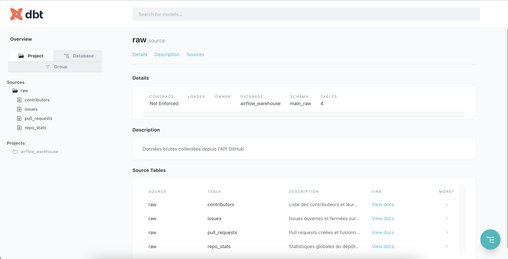
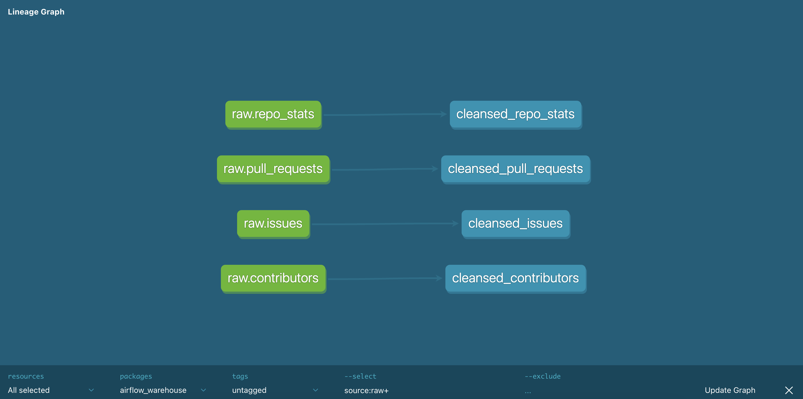

# 📊 Analyse des Données GitHub avec DuckDB & dbt

## 🚀 Objectif du Projet
Ce projet vise à collecter, transformer et analyser les données du dépôt **Apache Airflow** sur GitHub en utilisant **DuckDB** et **dbt**. L'objectif est d'automatiser le pipeline de données pour obtenir des insights sur les contributeurs, les issues, les pull requests et les statistiques du dépôt.

---

## 🏗️ **Architecture du Projet**

```md
├── README.md                   # Documentation du projet 
├── load_duckdb.py              # Script de chargement des données brutes dans DuckDB 
├── scripts/                    # Scripts de collecte des données depuis l'API GitHub 
│   ├── collect_contributors.py 
│   ├── collect_issues.py 
│   ├── collect_pull_requests.py 
│   ├── collect_repo_stats.py 
├── airflow_warehouse.db         # Base de données DuckDB 
│   ├── data/raw/               # Données brutes en format Parquet 
│   ├── utils/                  # Fonctions utilitaires pour l'auth et la pagination 
└── dbt/                        # Projet dbt pour la transformation des données
    ├── airflow_warehouse/
    │   ├── dbt_project.yml     # Configuration principale du projet dbt
    │   ├── models/             # Modèles dbt pour transformer les données
    │   │   ├── sources.yml     # Référencement des sources de données
    │   │   ├── cleansed/       # Modèles cleansed (tables finales)
    │   │   │   ├── cleansed_contributors.sql
    │   │   │   ├── cleansed_issues.sql
    │   │   │   ├── cleansed_pull_requests.sql
    │   │   │   ├── cleansed_repo_stats.sql
    │   ├── logs/               # Logs d'exécution dbt
    │   ├── target/             # Résultats compilés dbt
    ├── macros/                 # Macros dbt personnalisées
    ├── tests/                  # Tests dbt


---

## 📊 Documentation et Visualisation du DAG
### **1️⃣ Générer la documentation `dbt`**
```bash
dbt docs generate
```

### **1️⃣ Visualiser la documentation et le DAG **

```bash
dbt docs serve
```

Puis, ouvrez http://localhost:8080 dans votre navigateur pour voir : ✅ Documentation des sources et modèles cleansed
✅ DAG des transformations (graphique des dépendances des modèles)

## 📸 Captures d'Écran

Voici quelques captures d’écran illustrant la documentation et le DAG de `dbt`.

### **📊 Documentation générée par `dbt docs`**




### **🔗 Graphe DAG des modèles cleansed**


---

